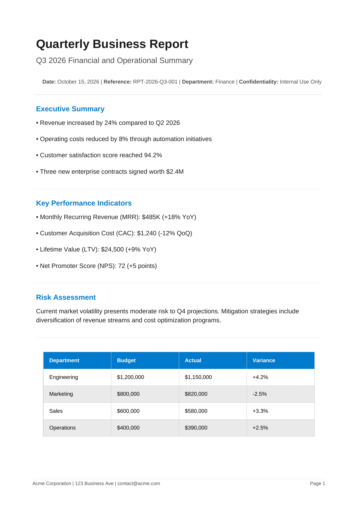
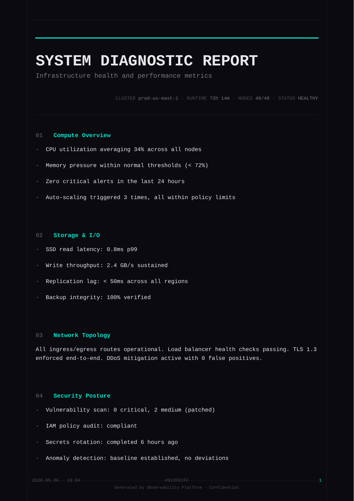

<div align="center">

[](https://git.io/typing-svg)

# PDF STYLE ENGINE · v2.0


**Modular PDF Engine · Professional & Dark Neon Themes · Dynamic Web Form Studio · Flask Server · Built with ReportLab**

</div>

---

## 📚 INDEX

- [⚡ Tech Stack](#-tech-stack)
- [🎨 Style System](#-style-system)
- [🗂 Project Structure](#-project-structure)
- [🎯 Features](#-features)
- [📦 Installation](#-installation)
- [🌐 Web Form Studio](#-web-form-studio)
- [💻 Python API](#-python-api)
- [⌨ CLI](#-cli)
- [🧱 Data Structure](#-data-structure)
- [🖌 Extending with Custom Styles](#-extending-with-custom-styles)
- [⚠️ Security Notice](#️-security-notice)
- [📜 License & Usage Terms](#-license--usage-terms)
- [📑 Requirements](#-requirements)

---

## ⚡ Tech Stack

| Layer      | Tech             | Role                            |
|------------|------------------|---------------------------------|
| Core       | Python 3.10+     | PDF generation engine           |
| PDF        | ReportLab        | Document rendering              |
| Web Server | Flask            | Local form server               |
| Frontend   | HTML + Vanilla JS| Interactive form UI             |
| CLI        | argparse         | Terminal-based generation       |
| Layout     | Custom           | Modular strategy pattern        |
| Fonts      | Helvetica        | Clean adaptive typography       |

---

## 🎨 Style System

✔️ Decoupled architecture — each style is fully independent
✔️ Strategy pattern — swap or extend styles without touching the core
✔️ Dynamic rendering — missing fields are silently omitted, no blank gaps

| Professional | Dark Neon |
|:---:|:---:|
|  |  |
| Clean corporate layout · Helvetica · neutral palette · optional logo | Charcoal dark · electric green accents · dot grid · minimalist neon |

---

## 🗂 Project Structure

```
pdf_generator/
│
├── pdf_generator.py       # Core engine — ProfessionalStyle + CyberStyle
├── form_app.py            # Flask server — serves the form & calls the engine
├── form.html              # Interactive web form UI (single-file, no deps)
├── generate_samples.py    # CLI tool + example data for both styles
│
└── output/
    ├── sample_professional.pdf
    └── sample_cyber.pdf
```

---

## 🎯 Features

### PDF Engine (`pdf_generator.py`)
- **Professional Style** — wide margins, Helvetica hierarchy, accent blue `#007ACC`, optional logo upload, alternating table rows, clean section separators, page-aware overflow
- **Dark Neon Style** — deep charcoal `#0D0D0D`, electric green `#39FF6E` accents, subtle dot-grid background, left-edge neon stripe, surface card sections, neon-ruled table, ASCII art block, SHA-256 footer hash
- **Deterministic output** — same data always produces identical bytes
- **Dynamic fields** — every key is optional; absent fields produce zero blank space

### Web Form Studio (`form_app.py` + `form.html`)
- **5-panel sidebar navigation** — Style, Metadata, Sections, Table, ASCII Art
- **Live style selector** — visual card toggle between Professional and Dark Neon
- **Logo upload** — drag & drop PNG/JPG, live preview before generating
- **Dynamic section builder** — add/remove/reorder content sections on the fly
- **Inline table editor** — add/remove columns and rows, first row auto-treated as header
- **One-click generate & download** — PDF streams directly to the browser, no page reload
- **Zero frontend dependencies** — pure HTML + Vanilla JS, no npm, no CDN

---

## 📦 Installation

```bash
pip install reportlab flask
```

---

## 🌐 Web Form Studio

The fastest way to create fully customised PDFs — fill a form, click generate, download.

```bash
python form_app.py
```

Then open **[http://localhost:5050](http://localhost:5050)** in your browser.

> ⚠️ **Security Warning**: `form_app.py` runs a **local development server** (`debug=False`, no HTTPS, no authentication). It is intended **strictly for personal, offline use** on your own machine. **Do not expose this server to the public internet** or run it on open networks. There is no input sanitization beyond basic file-type checking, and uploaded files are stored in temporary directories. For production deployments, use a proper WSGI server (Gunicorn, uWSGI) behind a reverse proxy with TLS termination and authentication.

### Form panels

| Panel | Fields |
|---|---|
| 🎨 **Style** | Theme selector (Professional / Dark Neon) · Logo upload |
| 📋 **Metadata** | Title · Subtitle · Date · Reference ID · Company · Contact · Hash ID |
| 📝 **Sections** | Unlimited sections — each with heading + free-text body |
| 📊 **Table** | Live cell editor · add/remove rows and columns dynamically |
| 🌑 **ASCII Art** | Monospaced art block (Dark Neon style only) |

> All fields are optional. Empty fields are automatically omitted from the final PDF.

---

## 💻 Python API

```python
from pdf_generator import generate_pdf

data = {
    "title":     "Annual Technology Review 2025",
    "subtitle":  "Strategic Infrastructure Assessment",
    "date":      "2025-05-06",
    "reference": "TEC-2025-0042",
    "company":   "Nexus Consulting Group",
    "contact":   "info@nexus.io · +1 800 555 0199",
    "sections": [
        {
            "heading": "Executive Summary",
            "body": "Cloud adoption accelerated by 34% YoY..."
        }
    ],
    "table": {
        "headers": ["System", "Status", "Coverage"],
        "rows": [
            ["AWS Cloud",   "Operational", "100%"],
            ["On-Prem K8s", "Degraded",    "94%"],
        ]
    }
}

# Professional style
generate_pdf("professional", data, "report.pdf")

# Dark Neon style
generate_pdf("cyber", data, "report_dark.pdf")
```

---

## ⌨ CLI

```bash
# Generate both sample PDFs
python generate_samples.py

# Generate a single style
python generate_samples.py --style professional
python generate_samples.py --style cyber

# Custom output directory
python generate_samples.py --out /path/to/folder
```

---

## 🧱 Data Structure

All keys are optional. Fields not present in the dict are silently skipped.

```python
{
    # ── Header / Metadata ──────────────────────────────────────
    "title":       str,   # Main document title
    "subtitle":    str,   # Secondary headline
    "date":        str,   # Date string shown in header
    "reference":   str,   # Reference / document ID
    "company":     str,   # Company or author name (footer)
    "contact":     str,   # Contact info line (footer)

    # ── Professional only ──────────────────────────────────────
    "logo_path":   str,   # Absolute path to a PNG/JPG logo

    # ── Dark Neon only ─────────────────────────────────────────
    "hash_id":     str,   # Footer hash ID (auto SHA-256 if omitted)
    "ascii_art":   str,   # Pre-formatted ASCII art block

    # ── Content ────────────────────────────────────────────────
    "sections": [
        {
            "heading": str,   # Section title (optional)
            "body":    str,   # Section body text (auto word-wrapped)
        }
    ],

    # ── Table ──────────────────────────────────────────────────
    "table": {
        "headers": ["Col A", "Col B", "Col C"],
        "rows": [
            ["val1", "val2", "val3"],
        ]
    }
}
```

---

## 🖌 Extending with Custom Styles

Subclass `BaseStyle` and register it under any name:

```python
from pdf_generator import BaseStyle, register_style
from reportlab.pdfgen import canvas
from reportlab.lib.pagesizes import A4

class RetroStyle(BaseStyle):
    def build(self, output_path: str) -> None:
        c = canvas.Canvas(output_path, pagesize=A4)
        # your drawing logic here
        c.save()

# Register and use like any built-in style
register_style("retro", RetroStyle)
generate_pdf("retro", data, "retro_doc.pdf")
```

---

## ⚠️ Security Notice

> **🔒 Local Use Only**
>
> This project includes a Flask development server (`form_app.py`) intended **exclusively for local, personal use**. It is **not hardened for production** and lacks:
> - HTTPS / TLS encryption
> - Authentication or access control
> - CSRF protection
> - Rate limiting
> - Comprehensive input validation
>
> **Never expose `form_app.py` to the public internet.** Always run it on `localhost` or within a trusted private network. Uploaded logos are stored in temporary files and deleted after generation, but no guarantees are made against malicious payloads.
>
> For any scenario beyond personal PDF generation on your own machine, deploy behind a reverse proxy (Nginx, Caddy) with TLS, use a production WSGI server, and implement proper authentication.

---

## 📜 License & Usage Terms

This project is licensed under the **Creative Commons Attribution-NonCommercial-NoDerivatives 4.0 International** (CC BY-NC-ND 4.0).

### What this means:

| ✅ You CAN | ❌ You CANNOT |
|---|---|
| Use, download, and run this software for **personal, educational, or research purposes** | Use this software or its output for **commercial purposes** (selling, monetizing, or integrating into paid products/services) |
| Share the original, unmodified source code with attribution | Create and share **modified versions** (derivatives) of this software |
| Generate PDFs for personal or non-profit use | Remove or alter the attribution / copyright notices |
| Reference this project in academic or educational contexts | Use the code as part of a commercial SaaS, agency service, or proprietary product |

### Full Legal Text

The complete license text is available in [`LICENSE`](LICENSE) or at:
https://creativecommons.org/licenses/by-nc-nd/4.0/legalcode

### Attribution Requirement

If you share this project, you must include:
- The original author credit
- A link to this repository
- A notice that the material is licensed under CC BY-NC-ND 4.0
- A link to the full license text

### Commercial Licensing

If you wish to use this project for **commercial purposes** — including but not limited to:
- Integrating into a paid product or service
- Using as part of client work or agency deliverables
- Including in a SaaS platform
- Redistributing modified versions

**Please contact the author to discuss a separate commercial license.**

> **TL;DR**: Free for personal use. Not free for business use. No remixing without permission. Attribution required.

---

## 📑 Requirements

- Python 3.10+
- ReportLab 4.0+
- Flask 3.0+ *(only required for the web form)*

---

<div align="center">


Python · ReportLab · Flask · Modular Architecture

</div>

Python · ReportLab · Flask · Modular Architecture

</div>
